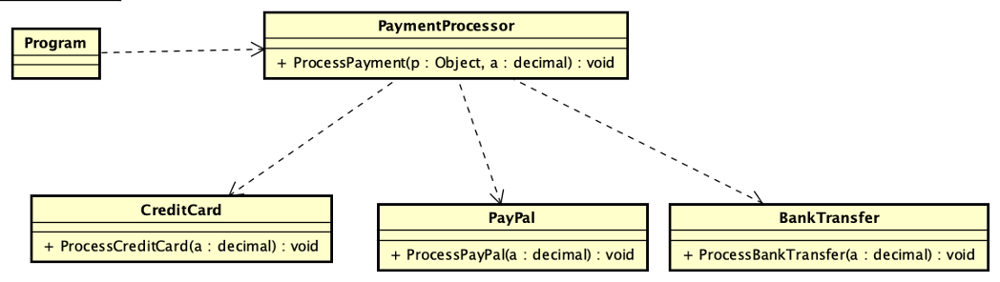
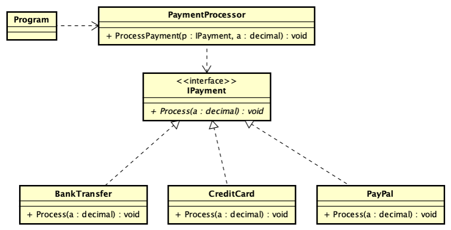

# Ejemplo de refactor de IF po
r polimorfismo

## Antes del refactor
el siguiente código y diagrama reflejan el código previo al refactor 

public void ProcessPayment(object payment, decimal amount)
{
//esto hay que mejorarlo,
//tampoco es bueno usar el downcasting

        if (payment is CreditCard)
        {
            ((CreditCard) payment).ProcessCreditCard(amount);
        }
        else if (payment is PayPal)
        {
            ((PayPal) payment).ProcessPayPal(amount);
        }
        else if (payment is BankTransfer)
        {
            ((BankTransfer) payment).ProcessBankTransfer(amount);
        }
    }
}

## Luego del refactor
El siguiente código y diagrama muestran el resultado del refactor a una solución polimórfica

    public void ProcessPayment(IPayment payment, decimal amount)
    {
        payment.Process(amount);
    }

