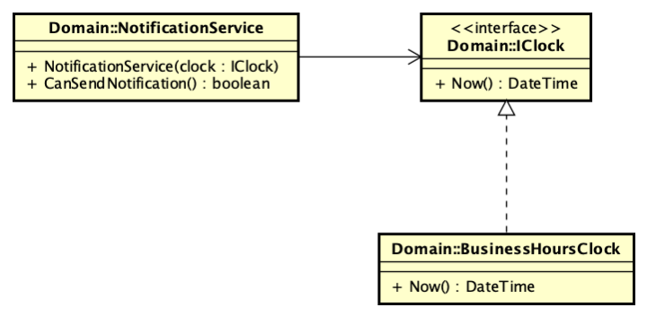

# Uso de Stub #

El siguiente ejemplo muestra el uso de un stub

La clase NotificationService es un servicio que envía notificaciones a los usuarios solamente en el horario laboral.
Para poder hacer las pruebas se necesita un reloj que permita simular distintos horarios.
Para esto se necesitaría `BusinessHoursClock` que tiene un método `now()` que devuelve la hora actual.

Las pruebas utilizando una clase real de `BusinessHoursClock` se pueden hacer porque el reloj real retorna la hora real.
Para las pruebas unitarias se necesita un stub que simule el comportamiento de `BusinessHoursClock` y devuelva una hora fija.
Para esto se crea un Stub que implementa la misma interfaz que `BusinessHoursClock` y devuelve una hora fija.

El ejemplo se encuentra diagramado en 
[diagrama UML Astah](images/NotificationService.asta)
