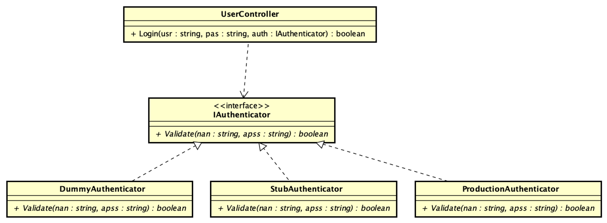

# Test Doubles #
Este ejemplo muestra cómo usar los test doubles, en particular Dummy y Stub

el diagrama muestra la idea que refleja el código.

Se muestran varios autenticadores, que implementan la misma interfaz
`IAuthenticator`, pero cada uno tiene un comportamiento diferente.
El ProductionAuthenticator es el que se utiliza en producción, mientras que
el DummyAuthenticator y StubAuthenticator son utilizados para pruebas.

### Dummy ###
se utiliza cuando se necesita solo para que compile. El dummy como el nombre
lo indica es tonto, no sabe hacer nada.

### Stub ###
Es un double que simula el comportamiento de un objeto real. Se utiliza para
En este caso verifica el usuario

