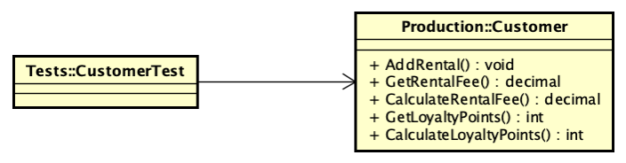
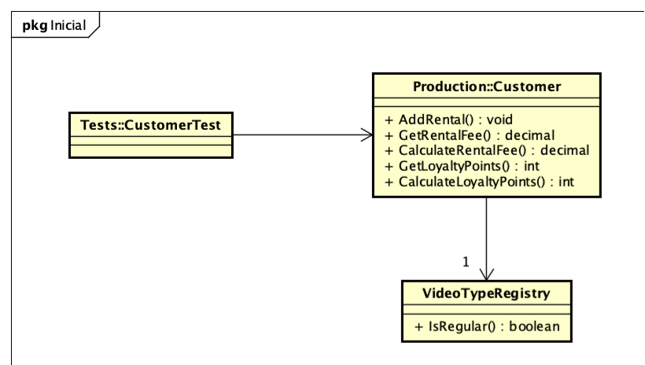
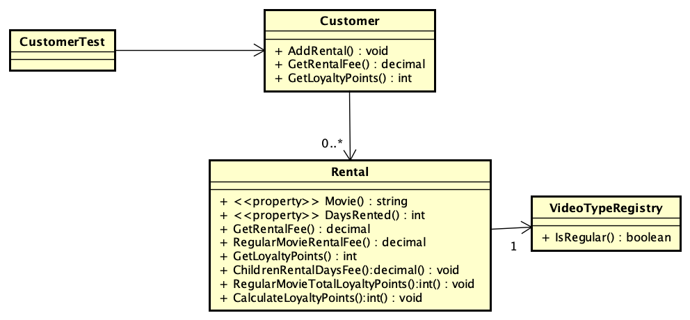
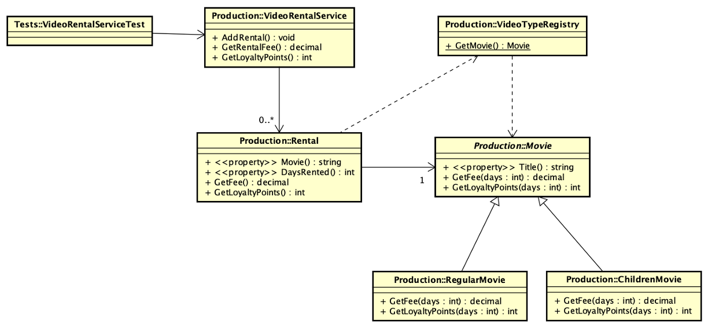

# Ejemplo de refactoring #
Ejemplo de refactoring con varios refactor que mejoran el diseño, mostrando como se puede desacoplar los test de las 
clases del dominio.

Basado en ejemplo de Cap 4. Clean Craftsmanship : Disciplines, Standards, and Ethics Por:Martin, Robert C.

## Requerimientos ##
R1 - el alquiler de las películas regulares cuesta $1.5 por el primer día y dan 1 punto de fidelización por cada día de alquiler.
R2 - el segundo y tercer día de las películas regulares es gratis, pero no se ganan puntos de fidelización.
R3 - los siguientes días de alquiler cuestan $1.5 por día y se gana 1 punto de fidelización por cada día de alquiler.
R3 - el alquiler de las películas infantiles cuesta $1 por día __y dan 1 punto de fidelización independientemente de la cantidad de días de alquiler.__
R4 - se deben poder alquilar más de una película.

## Refactoreos ##
Para observar los refactoreos es necesario ver las branches que se crearon y que se mantuvieron antes de hacer el merge a main.

Previo a refactorear comenzamos con solo una clase Customer y sus test en verde en la rama feat_refactor_example

Luego de agregar algunas pruebas se realiza el primer gran refactoreo, ver branch feat_Customer_refactor en el cual se extrae una primera clase.

Siguiendo con los mismo test se realiza el segundo gran refactoreo. El cual se puede observar en la rama feat_extract_rental
ahora el diseño se transforma en el siguiente solo mediante refactoreos.

Siguiendo con los mismos test se continua refactoreando para llegar al diseño final que se puede ver en la rama feat_extract_superclass

## Conclusión ##
Este ejemplo muestra como partiendo de un conjunto de test y refactoreando se puede llegar a un diseño completamente distinto y mas mantenible que el original.

