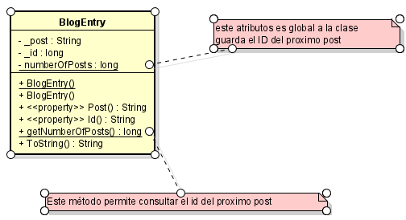
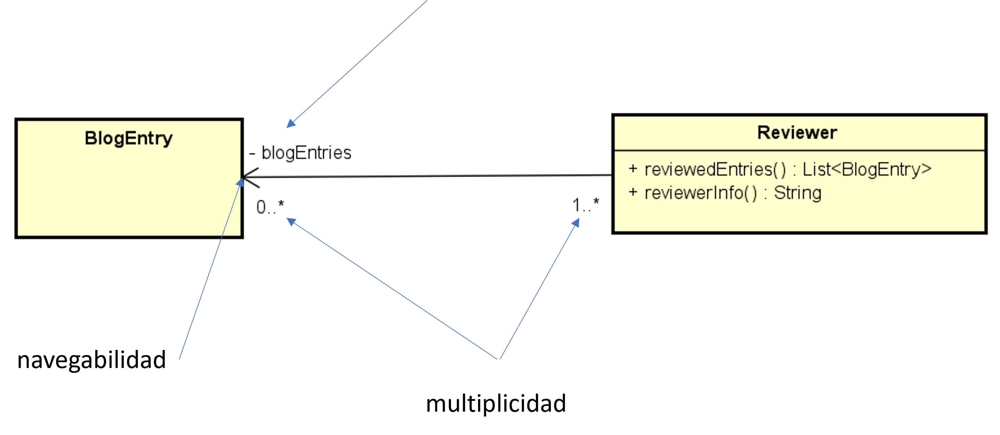
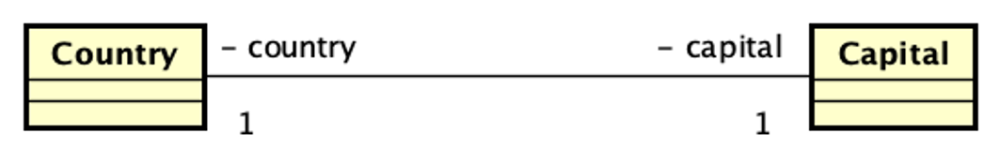
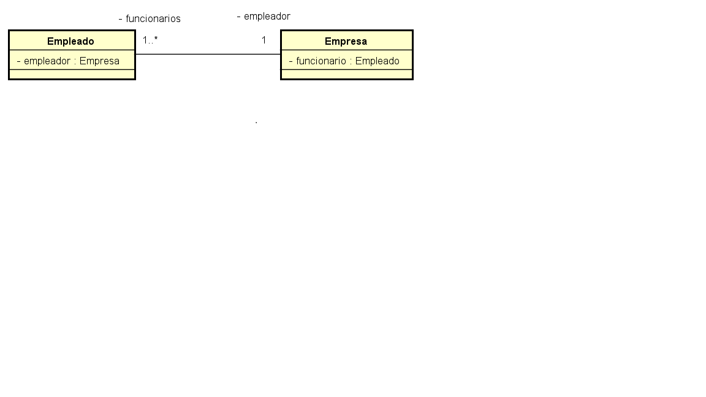

## UML Parte 1 
### Clase ###
El código muestra una clase **Persona** que corresponde con el siguiente diagrama de clases UML. En el código se ejemplifican varias formas de inicializar los objetos constructores y propiedades.


```
namespace PersonaDemo;

public class Persona
{
private string _nombre = "";
private string _celular = "";
private string _cedulaIdentidad = "";

    public Persona()
    {
        // notar el acceso a los atributos directamente, podria haberce usado las properties
        _nombre = "Sin nombre";
        _celular = "Sin celular";
        _cedulaIdentidad = "Sin cedula";
    }

    public Persona(string nombre, string celular, string cedulaIdentidad)
    {
        // notar el acceso a los atributos mediante las properties, podria haberce usado los atributos directamente
        Nombre = nombre;
        Celular = celular;
        CedulaIdentidad = cedulaIdentidad;
    }
    
    //getter y setters, en C# se llaman properties
    public string Nombre
    {
        get => _nombre;
        set => _nombre = value ?? throw new ArgumentNullException(nameof(value));
    }
    
    public string Celular
    {
        get => _celular;
        set => _celular = value ?? throw new ArgumentNullException(nameof(value));
    }
    
    public string CedulaIdentidad
    {
        get => _cedulaIdentidad;
        set => _cedulaIdentidad = value ?? throw new ArgumentNullException(nameof(value));
    }
    
    // cómo hago para evitar el persona1.CedulaIdentidad == persona2.CedulaIdentidad ?
    protected bool Equals(Persona other)
    {
        return _cedulaIdentidad == other._cedulaIdentidad;
    }

    public override bool Equals(object? obj)
    {
        if (obj is null) return false;
        if (ReferenceEquals(this, obj)) return true;
        if (obj.GetType() != GetType()) return false;
        return Equals((Persona)obj);
    }

    public override int GetHashCode()
    {
        return _cedulaIdentidad.GetHashCode();
    }

    public override string ToString()
    {
        return
            $"{nameof(_nombre)}: {_nombre}, {nameof(_celular)}: {_celular}, {nameof(_cedulaIdentidad)}: {_cedulaIdentidad}, {nameof(Nombre)}: {Nombre}, {nameof(Celular)}: {Celular}, {nameof(CedulaIdentidad)}: {CedulaIdentidad}";
    }
}
```

### Clases y relaciones. Implementacion en C# y Diagramas  

En esta solución se encuentran los siguientes proyectos:   

**[Blog](Blog/src)** - muestra el uso de propiedades, redefine el método Equals() y ToString() 


**[BlogEntryApp](BlogEntryApp/src)** - muestra la implementación de asociación direccional (1 a *) entre clases  


**CountryCapitalThisDelegationDemo** - muestra un ejemplo de implementación de asociación bidireccional (1 a 1) entre clases


**CountryCapitalRelationship** muestra como __NO__ es recomendable implementar asociaciones debido que crea acoplamiento inncesario

**[Roles](Roles/ClasesRoles/src)** - muestra un ejemplo de implementación de una asociacion bi direccional, de 1 a N entre empresa y Empleado 
usando los nombres de Rol como atributos. También muestra en el program como se establece la relación.


Para convertirla en uni-direccional se debe eliminar el atributo _empleador en la clase Empleado 
y eliminar la linea de código que asigna el empleador en la clase Empresa. 

```

public void AgregarEmpleado(Empleado employee)
{
        _funcionarios.Add(employee);

        // si se quiere que la relación sea unidireccional la siguiente línea no va
        employee.Empleador = this;
}

```