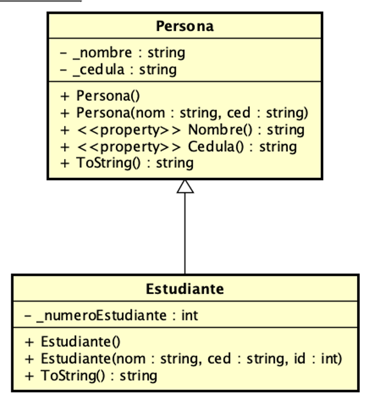
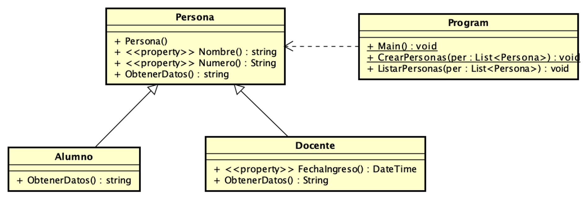
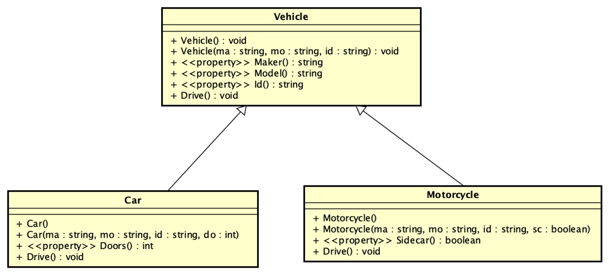
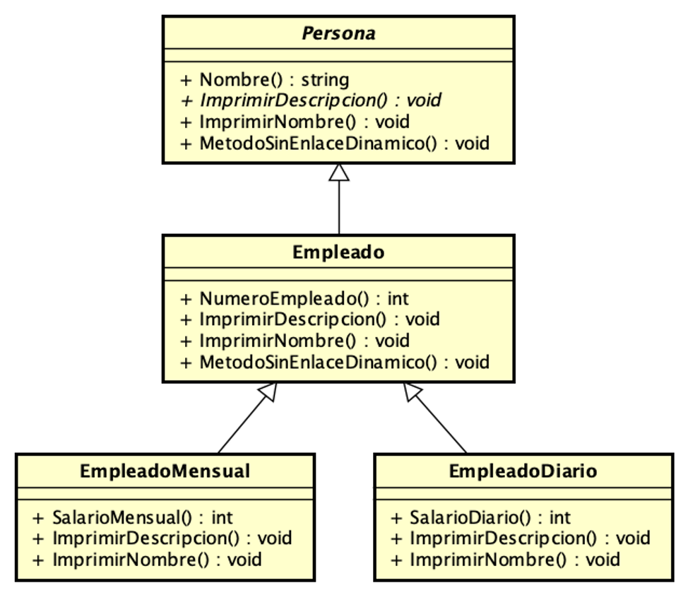
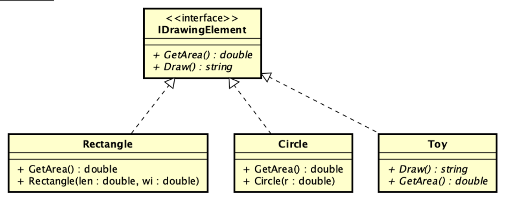
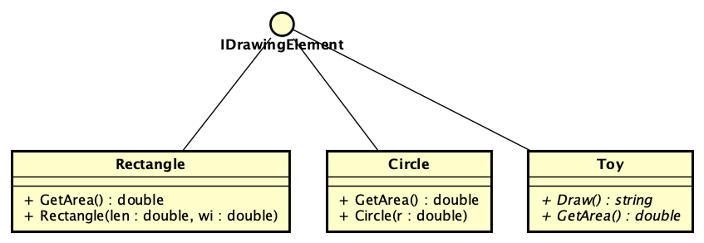

## UML - Herencia, polimorfismo e interfaces
### Breve descripción de los siguientes proyectos en la solución:

**Constructores - Orden de construcción**

Este ejemplo muestra una clase Persona, una clase Estudiante y la relación de herencia.
En el main se muestran la construcción de objetos de cada tipo.
__Revise por qué se inicializan mal__ los objetos y __arregle para que funcione correctamente.__

[Código fuente](OrdenConstruccion/src)

Diagrama de clases correspondiente:

**Enlace estático vs. dinámico**

Este ejemplo presenta código que ayudan a comprender el uso de virtual y override
lea el código de main y de las clases Docente, Alumno y PersonaUniversidad.

__Tener en cuenta que el código de Program puede no funcionar bien (ver warnings).
Hay un problema que es necesario arreglar.
El mismo se dejó con errores para que Ud. demuestre que comprende la herencia.__

__Tip__ - buscar los métodos con virtual y override en las clases.

[Código fuente](./PersonaEstudiante/PersonaEstudiante/src)

La variante del código ReccorrerPersonas muestra cómo recorrer una lista de Personas y mostrar su información __usando polimorfismo.__

[Código fuente](RecorrerPolimorficamente/src)

Diagrama de clases correspondiente:

**Vehicles**
Este ejemplo muestra el uso de herencia para representar Vehículos y utilizar polimorfismo en una lista de vehículos.

__Al igual que los anteriores ejemplos
revise si funciona correctamente listando la información que el main de la clase Program muestra.__

[Código fuente](VehicleInheritance/src)

Diagrama de clases correspondiente:

**Clase Abstracta**
Este ejemplo muestra como declarar una clase abstracta en C# 

[Código fuente](ClaseAbstracta/src)

___

## Interfaces vs. Herencia
Los siguientes dos ejemplos muestran el uso de interfaces y polimorfismo.
Es importante notar que en uno de los ejemplos ShapesUsingInheritance no es posible (conceptualmente)
hacer que el Toy herede de la clase Shape. Por eso se utiliza una interfaz en el ejemplo ShapesUsingInterface.

**ShapeUsingInterface**
Este ejemplo muestra la utilización de una interfaz IDrawingElement y cómo las clases Circle, Rectangle y Toy la implementan.
Vea cómo se crean los objetos de cada tipo y cómo se los trata polimórficamente cuando se los
agrega a una lista de IDrawingElement.  __El Toy__ que no es una figura geométrica igual puede ser dibujado.

[Código fuente](./ShapesUsingInterface)

Diagrama de clases correspondiente:

Tener en cuenta que este otro diagrama también muestra la interfaz, pero en formato Lollypop

**ShapeUsingInheritance**
Finalmente, este ejemplo muestra el mismo concepto pero utilizando herencia. Es importante ver que, en este caso, el Toy no se podría agregar a la lista de Shapes.

[Código fuente](./ShapesUsingInheritance)

## Colabore para mejorar ##
Si encuentra algún error, falta ortografica o tiene alguna sugerencia, por favor, hágamelo saber ingresando un issue [Issues](https://github.com/gamousquesORT/DemosDA1/issues).