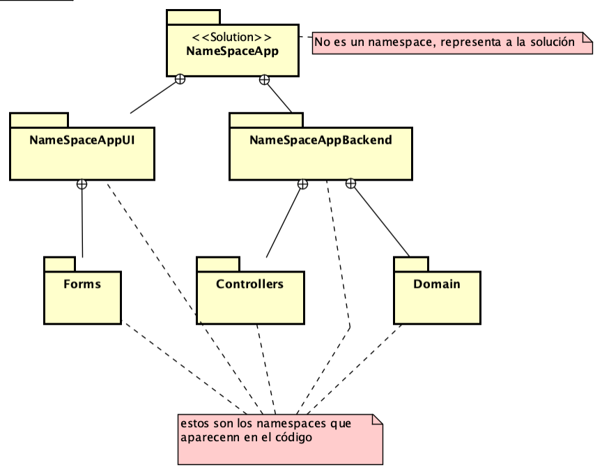
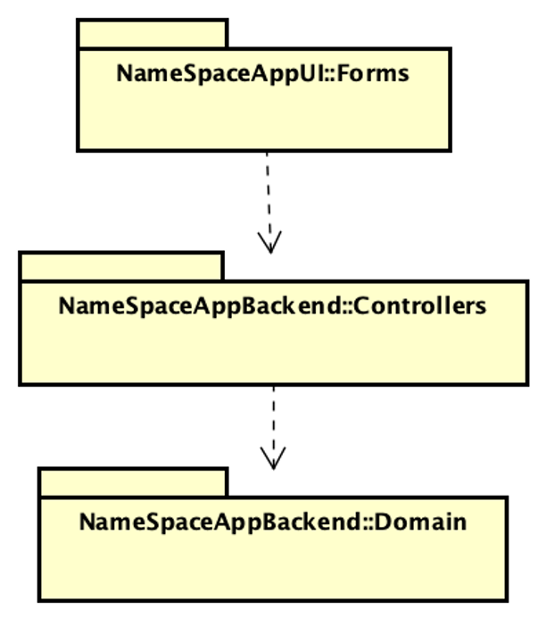

## UML Paquetes - Estructura de la solución
Este ejemplo muestra como se estructura una solución (NameSpaceApp) con dos proyectos,
uno de ellos es una biblioteca de clases y el otro es una aplicación de consola.

La biblioteca de clases contiene la lógica de negocio (NameSpaceBackend) y la aplicación de consola
es la interfaz de usuario (NameSpaceAppUI).

Diagrama de __paquetes de descomposición__ es correspondiente: 

Diagrama de __paquetes de uso__ es correspondiente:

### Colabore para mejorar ###
Si encuentra algún error, falta ortográfica o tiene alguna sugerencia, por favor, hágamelo saber ingresando un issue [Issues](https://github.com/gamousquesORT/DemosDA1/issues).