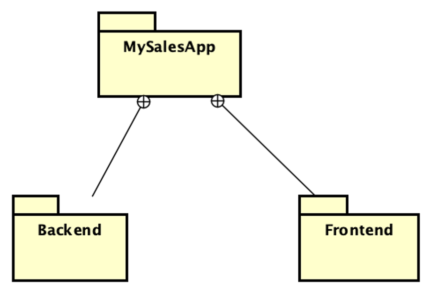
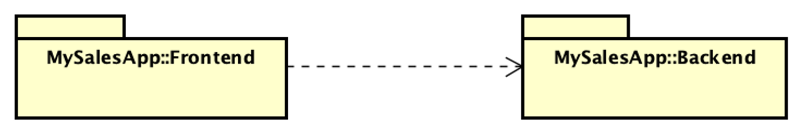

## UML Paquetes
### Breve descripción de los siguientes proyectos en la solución:

**MySalesApp**

Este ejemplo muestra como se representan los paquetes UML en C#.

Corresponde al [Código fuente](MySalesApp)

Revisar las sentencias __namspace__ para ver la jerarquía de los paquetes / namespaces.
Diagrama de clases correspondiente: 

Las sentencias __using__ se representan como dependencias entre paquetes.
Diagrama de clases correspondiente: 

### Colabore para mejorar ###
Si encuentra algún error, falta ortográfica o tiene alguna sugerencia, por favor, hágamelo saber ingresando un issue [Issues](https://github.com/gamousquesORT/DemosDA1/issues).